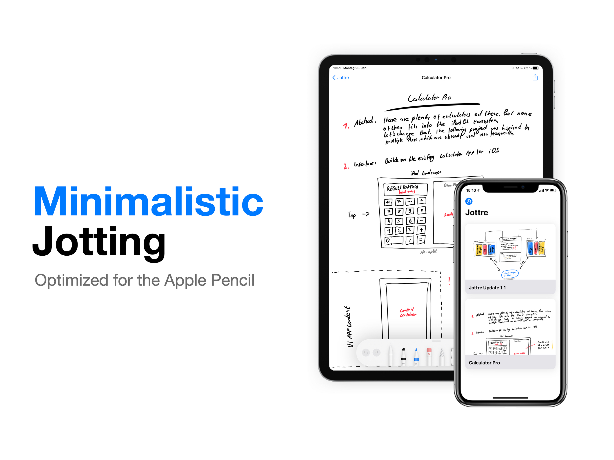
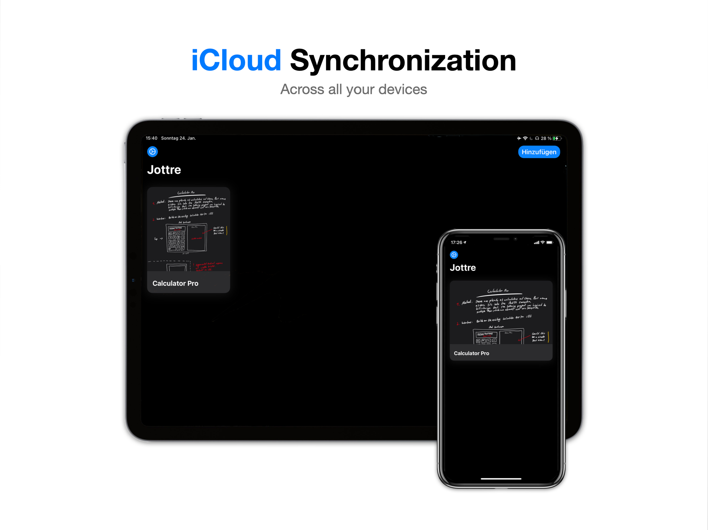
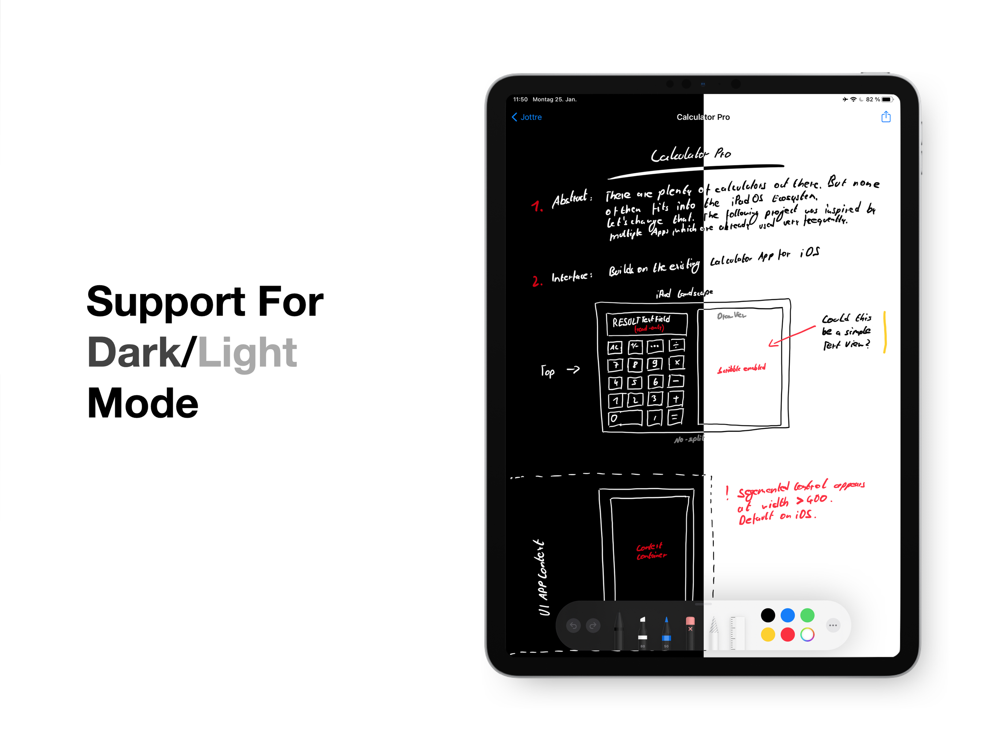

  

**Available on the [App Store](https://apps.apple.com/us/app/jottre/id1550272319)**

# Jottre

Simple and minimalistic handwriting app for iPadOS (and iOS, macOS).

At the moment the full version of Jottre only supports iPadOS. This means that 'Jottre for iPhone' and 'Jottre for Mac' are intended as read-only applications.

## Features

- Builds on the powerful PencilKit framework (iPadOS only)
- iCloud documents synchronization
- Support for dark and light mode
- Minimalistic design

## Preview

  

  

  

## Known issues

- [x] Drawings are not rendered in the correct userInterfaceStyle (when starting the app)
- [x] iCloud synchronization is not fast enough (documents are not uploaded directly)
- [x] Animation of CollectionViewCells (Deleting, Inserting...) not implemented
- [x] Deleting items takes too much time
- [ ] If removing items from collectionview, certain thumbnails were not shown correctly

## Up next

- Implementation of Multi-Window support (And split-view)
> For this feature the layout has to be modified so that it can be rendered on variable screen-widths (Get rid of UIScreen.main.bounds...)

- Support for Widgets
> How to render the thumbnails, so that most of the content is visible inside the viewable Widget area

- PDF Viewer
- PDF AnkAnnotations (Drawing on PDF via PDFKit)

  

`© Anton Lorani, 2021`
