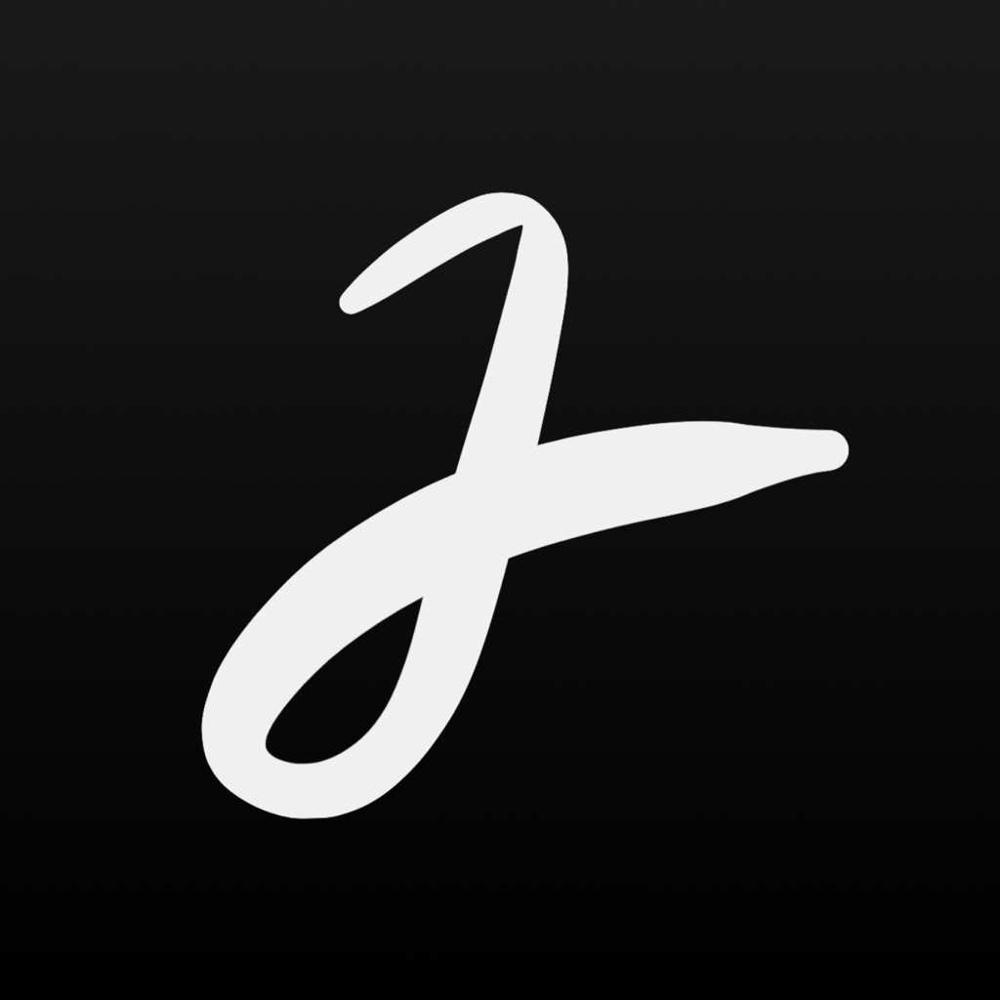
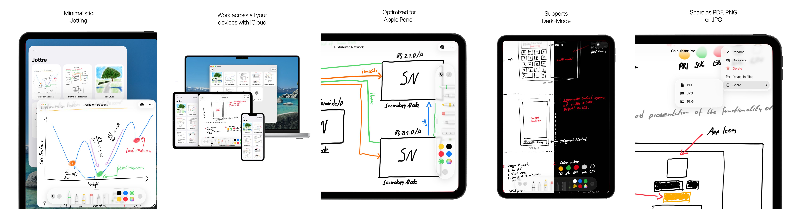

  

# Jottre

Simple and minimalistic handwriting app across Apple platforms.

**Available on the [App Store](https://apps.apple.com/us/app/jottre/id1550272319)**

> [!IMPORTANT]
> Modernization efforts are currently ongoing in `master`. Checkout the `v1.5` tag for viewing the current AppStore version.

## License

Copyright (C) 2021-2026 Anton Lorani

This program is free software: you can redistribute it and/or modify
it under the terms of the GNU General Public License as published by
the Free Software Foundation, either version 3 of the License, or
(at your option) any later version.

This program is distributed in the hope that it will be useful,
but WITHOUT ANY WARRANTY; without even the implied warranty of
MERCHANTABILITY or FITNESS FOR A PARTICULAR PURPOSE.  See the
GNU General Public License for more details.

You should have received a copy of the GNU General Public License
along with this program.  If not, see <https://www.gnu.org/licenses/>.
